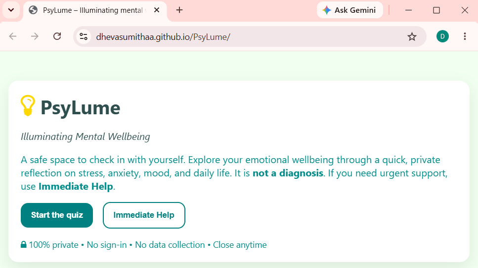

# 🌱 PsyLume
### *Illuminating Mental Wellbeing*

PsyLume is a privacy-focused web application designed to help individuals perform a quick **mental health self-assessment** through structured psychological reflection questions.

The application provides users with **personalized insights, emotional wellbeing indicators, and supportive self-care suggestions** based on their responses.

⚠️ PsyLume is **not a diagnostic tool**. It is intended for **self-reflection and awareness**, and it encourages users to seek professional help if distress levels appear high.

---

# 🌐 Live Demo

Try the application here:

🔗 https://dhevasumithaa.github.io/PsyLume/

---

# 📷 Application Preview

---

# 📌 Overview

Mental health challenges such as **stress, anxiety, emotional fatigue, and mood fluctuations** are common but often go unnoticed or unaddressed.

PsyLume aims to provide:

- A **quick private self-check**
- Awareness of **emotional and behavioral patterns**
- **Personalized supportive suggestions**
- Access to **immediate help resources**

The application runs entirely in the **browser**, meaning:

✔ No login required  
✔ No data collection  
✔ No server storage  
✔ Fully private experience  

All responses remain **on the user's device**.

---

# 🧠 Features

## 1️⃣ Structured Mental Health Self-Assessment

The app presents **25 reflective questions** covering multiple psychological domains including:

- Stress  
- Anxiety  
- Depression  
- Self-esteem  
- Perfectionism  
- Emotional awareness  
- Social interaction  
- Body image  
- Dissociation  
- Mood and energy  
- Coping patterns  
- Perception  
- Crisis indicators  

Each question uses a **Likert-scale response system**:

| Option | Score |
|------|------|
| Never | 0 |
| Rarely | 1 |
| Sometimes | 2 |
| Often | 3 |
| Always | 4 |

This allows quantitative scoring of emotional wellbeing.

---

## 2️⃣ Real-Time Progress Tracking

Users can view:

- Number of questions answered
- Completion percentage
- Dynamic progress bar

This improves engagement and usability.

---

## 3️⃣ Psychological Category Analysis

After submission, PsyLume analyzes responses and calculates **average intensity per psychological category**.

The system highlights the **top four emotional domains** where the user may be experiencing the highest distress.

Each category is accompanied by:

- A short explanation
- Practical self-care guidance

---

## 4️⃣ Emotional Distress Scoring

The system calculates a **normalized mental wellbeing score (0–100)**.

| Score Range | Interpretation |
|-------------|---------------|
| 0–20 | Doing well |
| 21–40 | Mild stress or anxiety |
| 41–60 | Moderate distress |
| 61–80 | High emotional strain |
| 81–100 | Critical concern |

Based on the score, PsyLume provides **tailored coping suggestions**.

---

## 5️⃣ Critical Condition Detection

Certain response patterns may indicate experiences associated with:

- Severe depression
- Suicidal ideation
- Dissociation
- Psychosis-like perceptions
- Obsessive-compulsive behaviors
- Hypomanic symptoms

If detected, PsyLume highlights these indicators and encourages **professional evaluation**.

This is **not a medical diagnosis**.

---

## 6️⃣ Immediate Help Resources

PsyLume includes an **Emergency Help Panel** with direct access to mental health support services.

Examples included:

- Emergency Services (India) – **112**
- National Mental Health Helpline (KIRAN) – **1800-599-0019**
- Tele-MANAS Mental Health Support – **14416**

These numbers can be customized depending on the user's region.

---

# 🛠 Technology Stack

PsyLume is intentionally built using **simple and accessible web technologies**.

| Technology | Purpose |
|-----------|--------|
| HTML5 | Application structure |
| CSS3 | Styling and responsive layout |
| JavaScript (Vanilla) | Logic, scoring system, UI interaction |

No frameworks or external libraries are required.

---

# 🔐 Privacy and Data Protection

A major design goal of PsyLume is **user privacy**.

✔ No data is transmitted to servers  
✔ No analytics tracking  
✔ No cookies or login required  
✔ All calculations run locally in the browser  

This ensures **complete user confidentiality**.

---

# 🧩 Application Workflow

The PsyLume workflow follows four main stages:

1. User starts the self-assessment  
2. The user answers 25 reflective questions  
3. The system calculates emotional wellbeing scores  
4. The results page provides insights, tips, and help resources  

---

# 📊 Psychological Domains Covered

PsyLume explores multiple emotional and cognitive domains including:

- Depression
- Stress
- Anxiety
- Self-esteem
- Perfectionism
- Social interaction
- Attachment concerns
- Body image
- Emotional awareness
- Dissociation
- Compulsive behavior patterns
- Coping mechanisms
- Energy and fatigue
- Mood elevation
- Perception patterns
- Crisis indicators

These domains help identify **patterns of emotional wellbeing** rather than diagnosing disorders.

---

# 💡 Motivation

PsyLume was created to explore how simple digital tools can promote **mental health awareness and emotional self-reflection**.

The goal was to design a **lightweight, privacy-first application** that helps users recognize patterns in their emotional wellbeing without requiring accounts, data storage, or external services.

This project also demonstrates how **behavioral health concepts can be translated into accessible web applications** using simple technologies.

---

# 🔬 Future Improvements

Possible future extensions include:

- Research-grade validated psychological scales
- Data visualization of emotional wellbeing trends
- AI-based personalized wellbeing recommendations
- Regional helpline auto-detection
- Optional anonymous research dataset generation

---

# ⚠️ Disclaimer

PsyLume is intended **only for educational and self-reflection purposes**.

The results:

- Do **not represent a clinical diagnosis**
- Should **not replace professional psychological assessment**
- Should **not be used for medical decision making**

If distress is persistent or severe, users are encouraged to consult a **licensed mental health professional**.

---

# 🚀 Running the Application

To run PsyLume locally:

### 1️⃣ Clone the repository

### 2️⃣ Open the project folder

### 3️⃣ Launch the application

Open the file: index.html 
in any modern web browser.

No installation or dependencies are required.

---

# 📄 License

This project is released under the **MIT License**, allowing free use, modification, and distribution with proper attribution.

---

# 👩‍💻 Author

**Dhevasumithaa Viswanathan**  
B.Tech Bioinformatics  
